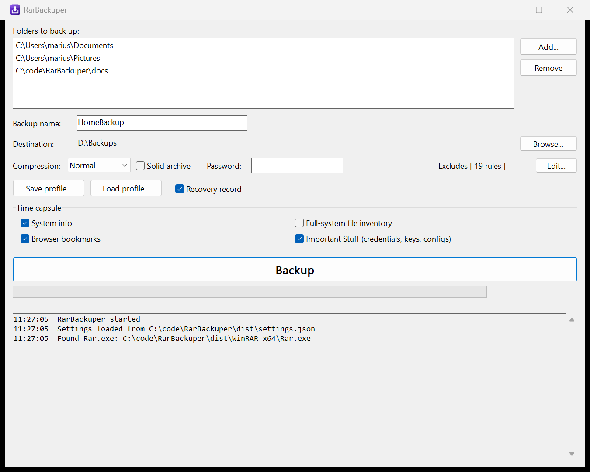

<p align="center">
  
</p>

<h1 align="center">RarBackuper</h1>

<p align="center">
  An easy Windows backup tool: pick folders, press <b>Backup</b>, get one timestamped,
  password-protectable RAR archive with a recovery record — plus an optional
  "time capsule" snapshot of your whole machine.
</p>

<p align="center">
  
</p>

RarBackuper is a single small native Win32 C++ executable with **zero runtime
dependencies** (no .NET, no frameworks, statically linked). It drives the
WinRAR command-line tool (`Rar.exe`) as a child process, so archives are
standard `.rar` files you can open anywhere.

## Features

- **One-button backups** — archives all selected folders into a single
  `<Name>_<yyyy-MM-dd_HHmm>.rar` in your destination folder. History
  accumulates; existing archives are never touched.
- **Real progress** — a pre-scan counts the files first, then RAR's output is
  parsed live for a true file-count progress bar and a full textual log.
- **Smart exclude rules** — sensible defaults for junk and regenerable data
  (`.git`, `node_modules`, `bin`/`obj`, `Thumbs.db`, `*.tmp`, …) plus a
  comfortable editor for folder / file / wildcard-pattern rules.
- **Encryption** — optional password encrypts both data and headers
  (`-hp`). The password lives only for the session: it is never written to
  disk and is masked as `-hp***` in every logged command line.
- **Recovery record** — archives get `-rr1` by default (a checkbox turns it
  off), so minor media damage is repairable.
- **Archive comment stamp** — machine name, date, the exact folder list and
  the full exclude rule set are embedded as a RAR comment, visible in any
  WinRAR UI without extracting.
- **Profiles** — export/import the whole configuration as a `*.rbprofile`
  JSON file (passwords excluded, of course).
- **Drag & drop**, completion tray notification, and an *Open destination*
  button that selects the fresh archive in Explorer.

### Time capsule (optional)

Each checkbox adds machine-snapshot extras under `_meta\` in the archive root:

| Extra | What you get |
|---|---|
| **System info** | Machine passport (OS, CPU, RAM, BIOS/board serials, timezone) and a full drives map: per-disk model/serial/sector sizes and per-partition type GUIDs, offsets, sizes, filesystems, volume serials — enough for recovery tooling if a partition table dies. |
| **Full-system file inventory** | `filelist-<drive>.txt` per fixed drive: every file with size and modified date, so you can later find what was *never* backed up. |
| **Browser bookmarks** | Bookmark stores from Chrome, Edge, Brave, Vivaldi, Opera and Firefox, per profile. |
| **Important Stuff** | A curated 13-group detector catalog (SSH keys, KeePass vaults, cloud CLI credentials, VPN configs, Wi-Fi profiles, installed-program lists, editor settings, Sticky Notes, …) copied with a per-file size cap and a generated `manifest.txt` containing the original path and step-by-step restore instructions for every item. |

If *Important Stuff* is enabled without an archive password, the app warns
you before starting — those files contain credentials in plain form.

The capsule is staged in a `_meta` folder **inside the destination** (never
`%TEMP%`), archived, then deleted — all I/O stays on the destination volume.

### Headless CLI

The same exe doubles as a command-line tool for scripted or scheduled runs:

```text
RarBackuper.exe backup [options]

  --profile <file.rbprofile>  use this configuration instead of settings.json
  --password <pw>             archive password for this run (never persisted)
  --dest <folder>             override the destination folder
  --name <name>               override the backup name
  --no-capsule                skip all time-capsule collection
  --yes                       auto-confirm interactive warnings

Exit codes: 0 success, 1 warnings, 2 validation failure, 3 backup failed, 4 cancelled
```

Output streams to stdout (redirection-friendly); Ctrl+C cleans up the partial
archive and staging folder.

## Getting started

### Requirements

- Windows 10/11 x64
- A licensed **WinRAR** distribution folder (containing `Rar.exe` and
  `UnRAR.exe`) placed next to `RarBackuper.exe` — WinRAR is proprietary
  software and is **not** included in this repository

### Build

Toolchain: MinGW-w64 GCC (UCRT) + CMake + Ninja. MSVC should work too — the
project avoids MinGW-only constructs.

```powershell
cmake -S . -B build -G Ninja
cmake --build build
```

The distributable, statically linked Release exe lands in **`dist\`**; if a
`WinRAR-x64` folder exists at the repo root it is copied beside it, making
`dist\` a ready-to-run package. The test runner stays in `build\`.

### Run

Double-click `dist\RarBackuper.exe`. On first start it logs where it found
`Rar.exe` (it searches the exe's folder, then the working directory, three
levels deep). Settings persist automatically to `settings.json` next to the
exe on every change.

## Design guarantees

- **No temporary folders.** Archives are written directly to the destination;
  `-w` is never passed and `%TEMP%` is never used.
- **The password never touches disk** — not in `settings.json`, not in
  profiles, masked in every logged command line.
- Each run creates a **new** timestamped archive; nothing is modified or
  overwritten.
- On failure or cancel the RAR process is killed and the partial archive is
  deleted.
- The app **never requests elevation**. Detectors that would need admin
  rights collect what is accessible and note the limitation in the manifest
  and log.
- Backups run on a worker thread; the UI stays responsive and is updated only
  via message passing.

## Testing

A separate console test exe (doctest) covers the pure core (command-line
builder, output parser, exclude matching, archive naming, settings model,
detector catalog) and runs integration tests against the real `Rar.exe`:
archive creation, exclude semantics, password round-trips, cancel cleanup,
comment round-trips with non-ASCII text, pre-scan/progress parity, and a
whole-app end-to-end run through the CLI.

```powershell
cmake --build build
.\build\rarbackuper_tests.exe
```

## Project layout

```
src/core/     pure logic - no UI or process dependencies, fully unit-tested
src/engine/   backup engine: process driving, settings I/O, time capsule
src/win/      Win32 GUI (single window + exclude rules dialog)
src/cli/      headless command-line mode
res/          manifest, icon (make-icon.ps1 regenerates app.ico)
tests/        doctest unit + integration tests
```

The engine talks to both front-ends through a small `EventSink` interface,
so the GUI and the CLI share every code path that matters.

## License

The RarBackuper source code is released under the [MIT License](LICENSE).

WinRAR / `Rar.exe` are proprietary products of win.rar GmbH / Alexander
Roshal and are **not** part of this project — you must provide your own
licensed copy.
